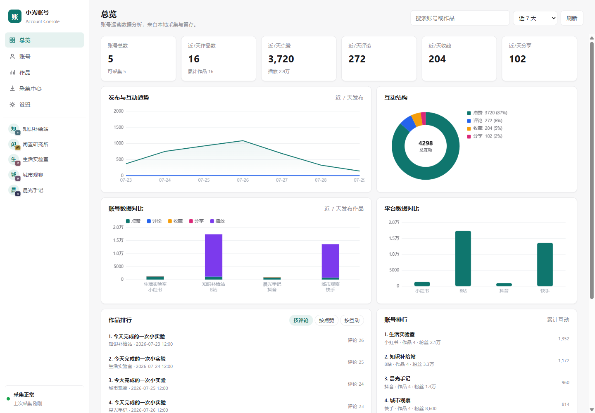
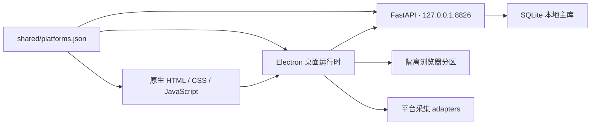

# 小光账号

小光账号是一款 Windows 本地优先的多平台账号运营桌面软件。它把账号资产、隔离登录态、公开作品数据、采集记录和人工发布入口统一在一个工作台中；所有业务数据默认保存在本机 SQLite，不依赖云端服务。

当前版本：`0.2.6`



## 核心能力

- 账号管理：添加、编辑、筛选和拖拽排序账号；每个账号使用独立浏览器分区保存登录态。
- 自动资料同步：登录成功后自动补全昵称、头像、平台账号 ID 和公开主页；只使用稳定身份进行去重。
- 本地数据分析：查看近 7～180 天的作品、互动趋势、平台对比和账号排行。
- 公开数据采集：支持手动、应用内定时、托盘和无界面采集入口，统一记录进度与失败原因。
- 人工发布工作区：复用账号登录态打开平台页面，但不自动上传、填写或点击发布。
- 本地运行：Electron 桌面壳、FastAPI 后端和 SQLite 数据库全部运行在本机。

## 支持的平台

| 平台 | 账号工作区 | 公开作品采集 | 主要公开指标 |
| --- | --- | --- | --- |
| 抖音 | 支持 | 支持 | 点赞、评论、收藏、分享 |
| 快手 | 支持 | 支持 | 点赞、评论、分享、播放 |
| 小红书 | 支持 | 支持 | 点赞；评论与收藏视公开响应而定 |
| B 站 | 支持 | 支持 | 播放、评论 |
| 闲鱼 | 支持 | 暂不支持 | — |

平台网页和公开响应会持续变化，真实登录与采集仍需要在发布前人工抽测。

## 架构



关键领域词汇、不变量和 seam 见 [CONTEXT.md](CONTEXT.md)，已接受的架构决策见 [docs/README.md](docs/README.md)。

## 开发环境

当前源码面向 Windows 10/11。需要：

- Node.js `>= 22.12.0`
- Python `>= 3.10`
- npm

安装依赖：

```powershell
npm install
python -m pip install -r requirements.txt
```

启动桌面端：

```powershell
npm run start
```

也可以只启动本地 FastAPI：

```powershell
npm run server
```

开发数据默认写入仓库下的 `data/`。如需隔离测试数据，可在启动前设置：

```powershell
$env:ACCOUNT_CONSOLE_DATA = "D:\account-console-dev-data"
npm run start
```

## 检查与构建

```powershell
npm run test    # Node + Python 回归测试
npm run check   # JavaScript 语法检查 + 全部回归测试
npm run pack    # 构建 Windows 解压目录 dist/win-unpacked
npm run dist    # 构建 Windows portable 成品
```

`npm run pack` 会先通过 PyInstaller 生成内置 FastAPI 后端，再交给 electron-builder 打包。构建产物位于 `dist/`、`dist-backend/` 和 `.build/`，均不进入 Git。

更多开发、数据目录和脚本说明见 [docs/DEVELOPMENT.md](docs/DEVELOPMENT.md)。

## 数据与隐私

运行数据包括数据库、账号登录态、日志和备份，全部位于数据目录：

```text
data/
├── account_console.sqlite3
├── electron-profile/
├── browser_profiles/
├── backups/
└── logs/
```

这些内容均已通过 `.gitignore` 排除。提交代码前仍应执行敏感信息检查，禁止把真实数据库、Cookie、令牌、账号主页清单或平台响应样本提交到仓库。

## 产品边界

采集器只读取浏览器能够正常访问的公开页面和公开响应，不绕过验证码、风控或访问限制。发布动作保持人工完成，不自动上传内容、不自动填写文案、不自动点击发布。

使用者需要自行确认其使用方式符合所在地区法律、平台条款以及账号所属组织的内部规则。

平台名称仅用于说明兼容性。本项目与抖音、快手、小红书、B 站、闲鱼等平台不存在隶属、合作、赞助或认可关系。

## 项目结构

```text
assets/      应用图标
backend/     FastAPI、SQLite、分析聚合与采集入库
electron/    桌面壳、账号会话、平台采集与运行时监督
frontend/    管理台页面、交互和图表
shared/      多运行时共用的平台能力声明
scripts/     Windows 开发、构建、启动和调度脚本
tests/       Node 与 Python 回归测试
docs/        架构决策、开发说明和维护记录
```

## 参与开发

请先阅读 [CONTRIBUTING.md](CONTRIBUTING.md)。

## 许可证

项目代码与项目自制视觉资源采用 [Apache License 2.0](LICENSE)。平台名称属于各自权利人，仅用于说明兼容性；详见 [NOTICE](NOTICE)。
